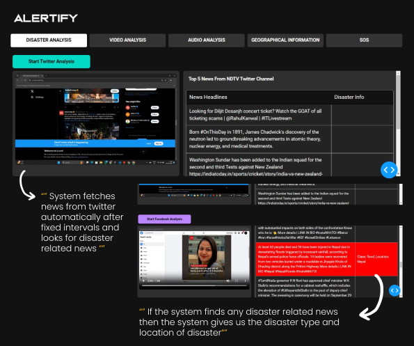
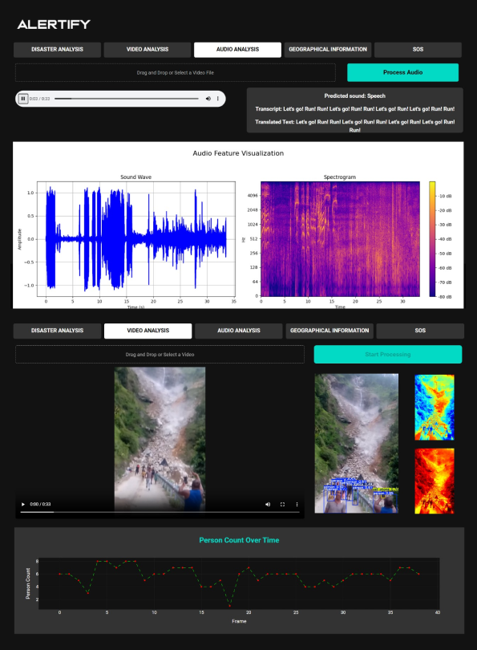
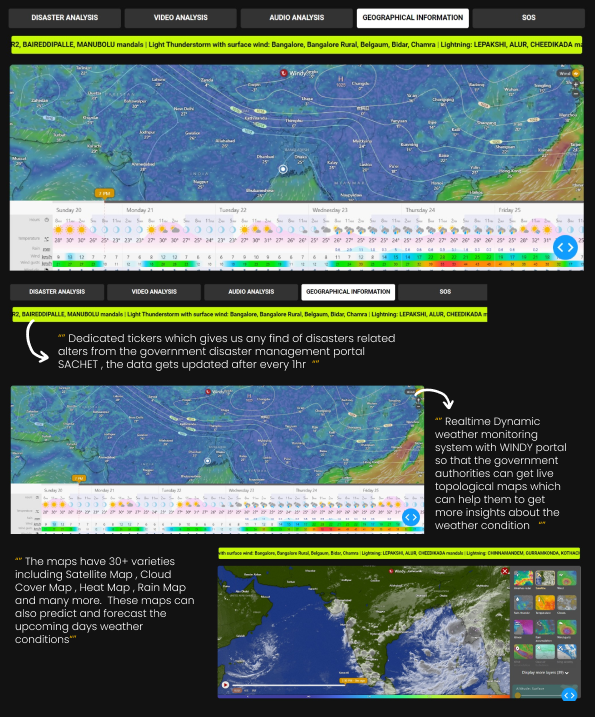
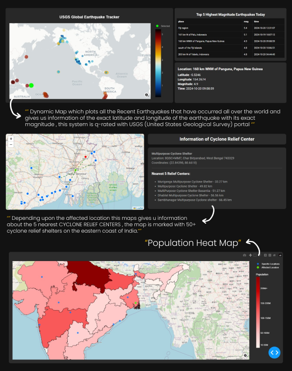
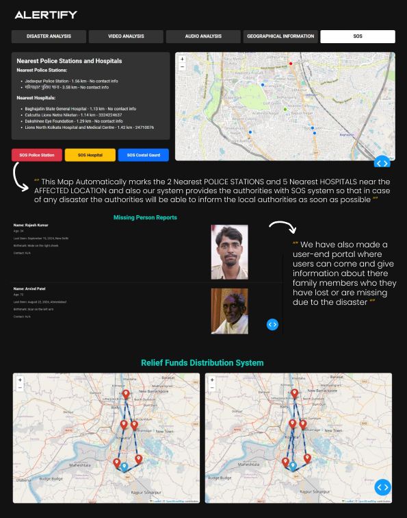

# ALERTIFY

Alertify is an advanced disaster management and response system that continuously gathers data from social media platforms, news portals, and other online sources, including text, images, videos, and live streams. Instead of detecting disasters directly, it classifies posts as disastrous based on the information collected. Utilizing neural networks, Alertify analyzes and categorizes various disaster-related content, such as earthquakes, floods, and wildfires. Real-time video analysis, audio recognition in multiple languages, and thermal mapping provide valuable insights. Through the Alertify dashboard, SOS signals are sent via SMS to connect with response teams, hospitals, and police stations, facilitating timely communication during emergencies. Additionally, Alertify incorporates satellite geomapping for live imagery and manages an NDRF relief center inventory, along with a system for reporting missing persons. This accumulated data is then provided to the NDRF to enhance disaster response efforts.

## Installation

create a virtual environment

bash
python -m venv venv
venv\Scripts\activate
source venv/bin/activate

Install dependencies
bash
pip install -r requirements.txt

## How to Use

python
python final_dash.py

## Features

### 1. Real-Time Data Aggregation:
The system will continuously gather data from various sources, including social media platforms (such as Twitter, Facebook, and Instagram), news portals, and other relevant online platforms. This data encompasses text-based posts, images, videos, live streams, and official announcements. Additionally, a neural network is employed to identify and classify different types of disasters—such as earthquakes, floods, wildfires, and hurricanes—along with specific events occurring within those disasters.

### 2. Video Analysis:
Real-time video analysis provides up-to-date insights into evolving disaster scenarios through object detection, thermal data and magma mapping scrapping directly from relevant media sources and news portal allowing response teams to make informed decisions on where to allocate resources.

### 3. Audio Analysis:
It identifies the source of sound from audio data  and that audio content will be recognized  in multiple languages  and translated into the preferred language of the response teams, ensuring that critical information is not lost due to language barriers.

### 4. Satellite Mapping:
It integrates real time data from trusted platforms like Windy and USGC Maps, alongwith analyzing satellite imagery, terrain and weather information using geospatial tools for verification and data authenciation to support disaster response teams in monitoring, assessing, and responding to emergencies.

### 5. SOS System:
It will allow individuals to send distress signals through multiple platforms, including mobile apps, SMS, social media (Twitter, Facebook), and even voice-activated commands  providing  real time location and emergency details , enabling disaster response agencies to send alerts and connect with nearby police stations, hospitals and coastal guards.

### 6.Relief center inventary management mising person report:
Our relief center inventory management system utilizes geospatial mapping to optimize the distribution of relief items from the main NDRF hub to local relief centers. By employing the Traveling Salesman Algorithm, the system identifies the shortest and most efficient routes for delivering supplies, ensuring timely assistance to affected areas.
### 7. Missing person report:
Our system includes a feature that allows the general public to report missing persons during a disaster through a dedicated user dashboard. These reports are reflected in the main NDRF dashboard, streamlining the communication process with local police authorities and facilitating the timely reporting of missing individuals.
### 8. Real time alerts:
Our system involves scraping the latest alerts related to rainfall, thunderstorms, and other disasters from government-sanctioned platforms. These real-time alerts are displayed on our interface, ensuring that users receive timely and accurate information about potential hazards. This functionality enhances situational awareness and enables proactive measures to be taken in response to changing weather conditions.
